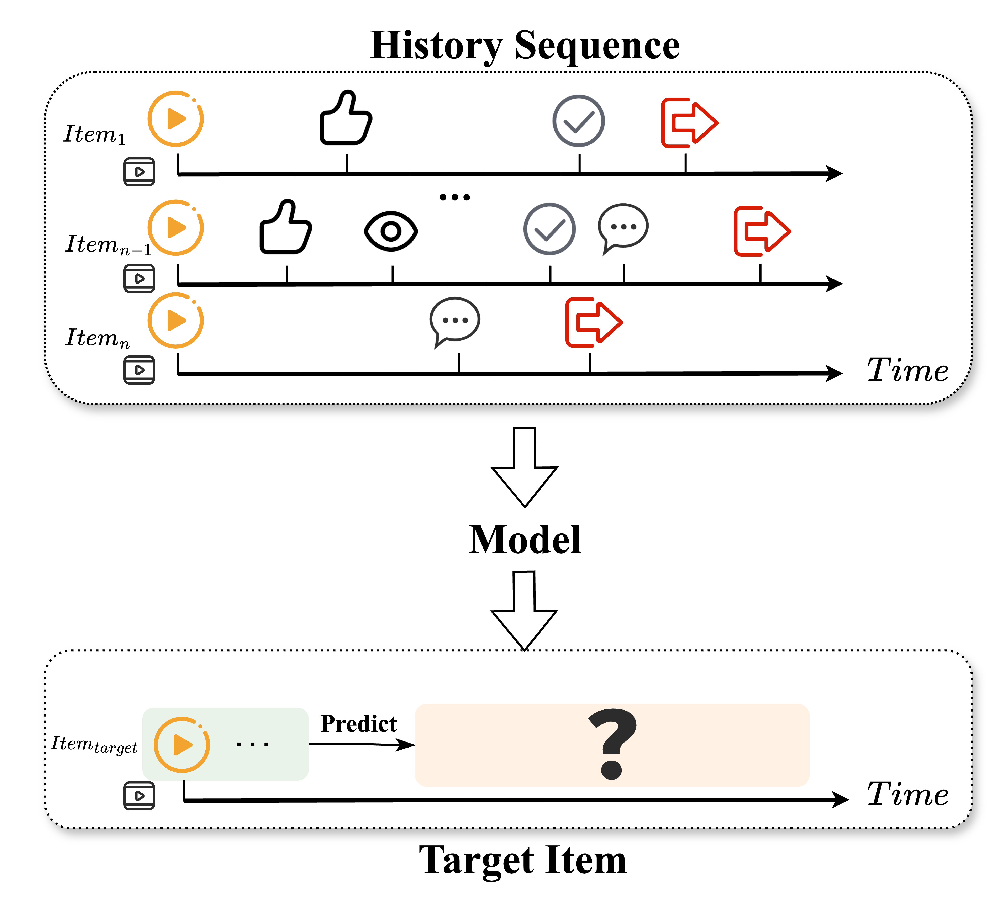
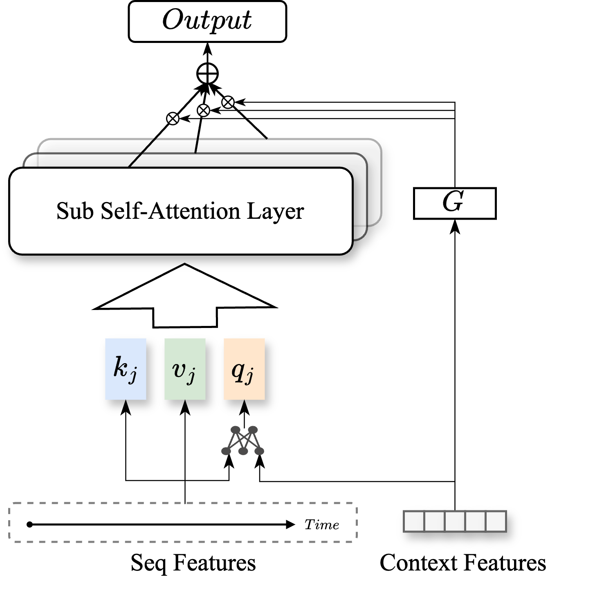
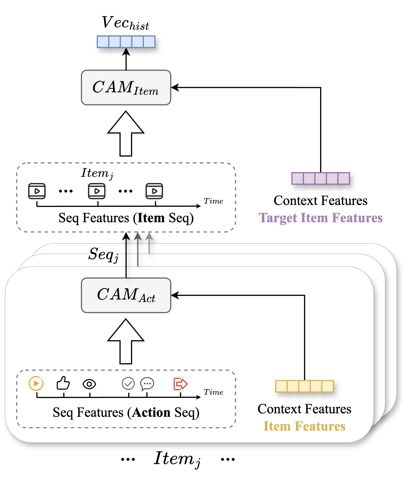
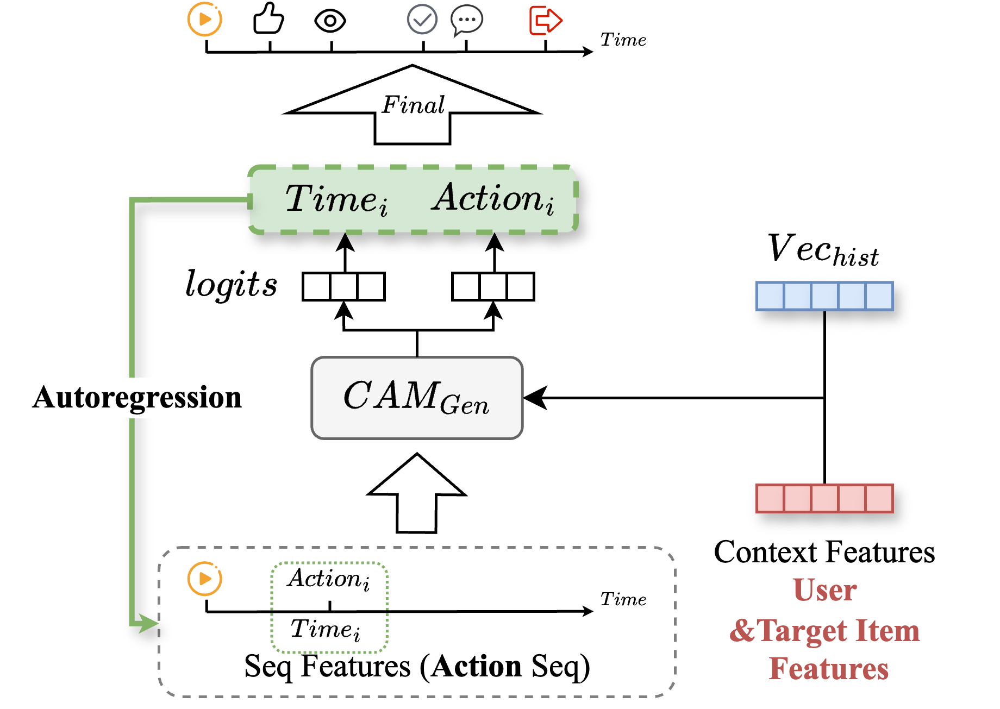
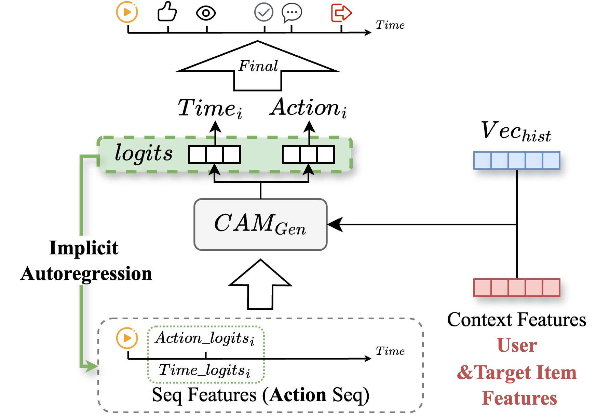
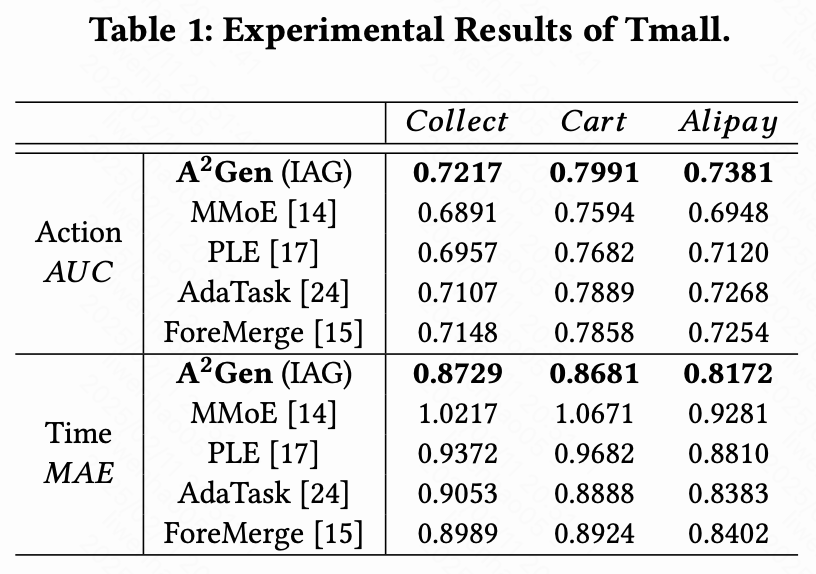
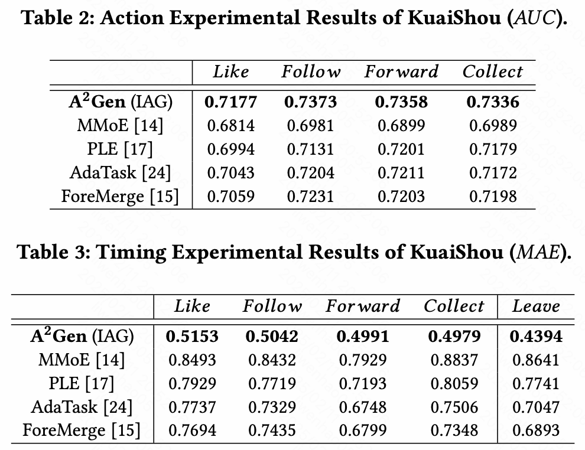

# A<sup>2</sup>Gen: An Action-Aware Generative Sequence Network for Short Video Recommendation

## Project structure
```
├── config
    ├── args.py
├── data_loader
    ├── data_loader.py
├── img
    ├── *.png
├── main_modules
    ├── A2Gen_modules.py
    ├── modules.py
├── train
    ├── train.py
├── .gitignore
├── README.md
```

## User Action Sequence Introduction


## Model Main Process




## Model Architecture

### CAM



### HSE



### EAG



### IAG




## Experiments





